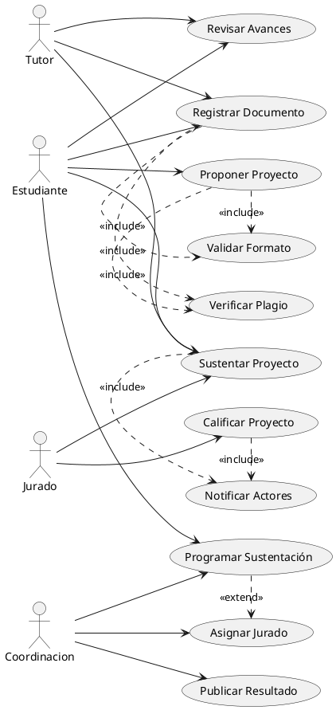
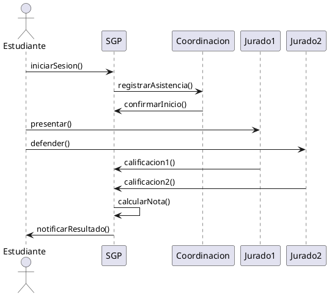
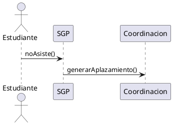
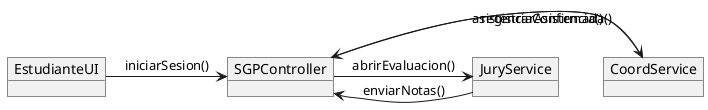
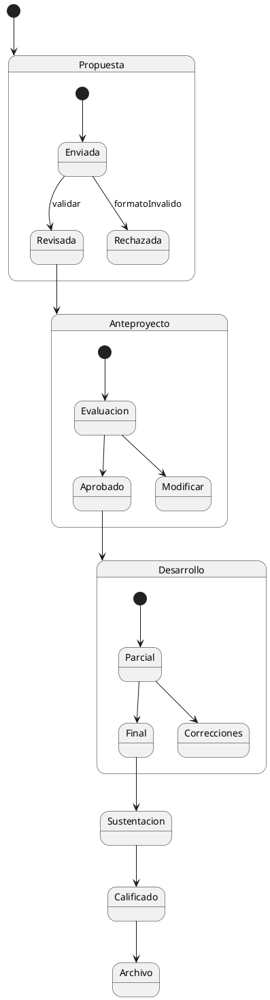

#  **PORTAFOLIO UML DINÁMICOS – SGP FESC**

# PORTAFOLIO UML DINÁMICOS – SISTEMA DE GESTIÓN DE PROYECTOS DE GRADO (FESC)

##  1. DIAGRAMA DE CASOS DE USO COMPLETO (PLANTUML)

---

##  2. MATRIZ DE TRAZABILIDAD — SISTEMA SGP FESC

| ID Req | Requisito del Sistema FESC             | Caso de Uso |
| ------ | -------------------------------------- | ----------- |
| R1     | Registro de propuesta                  | CU1         |
| R2     | Validación del formato del documento   | CU8         |
| R3     | Verificación de plagio                 | CU9         |
| R4     | Revisión de avances                    | CU2         |
| R5     | Registro / Actualización de documentos | CU3         |
| R6     | Programación de sustentación           | CU4         |
| R7     | Asignación de jurado                   | CU10        |
| R8     | Sustentación del proyecto              | CU5         |
| R9     | Calificación del proyecto              | CU6         |
| R10    | Publicación del resultado              | CU7         |
| R11    | Notificación automática                | CU11        |

---

##  3. ESPECIFICACIONES DETALLADAS DE LOS 3 CASOS CRÍTICOS

---

###  **CASO CRÍTICO 1 — Proponer Proyecto (CU1)**

**Actor Principal:** Estudiante
**Secundarios:** Tutor, Sistema

**Precondiciones:**

* El estudiante tiene tutor asignado.
* El estudiante está matriculado en la asignatura de proyecto.

**Postcondiciones:**

* Propuesta registrada.
* Formato verificado.
* Plagio evaluado.

**Flujo Principal:**

1. El estudiante ingresa al sistema.
2. Diligencia el formulario de propuesta.
3. Adjunta el documento.
4. El SGP ejecuta `Validar Formato (CU8)`.
5. El SGP ejecuta `Verificar Plagio (CU9)`.
6. Se registra la propuesta.
7. Se notifica al tutor.

**Flujos Alternativos:**

* A1: Formato inválido → se rechaza y notifica.
* A2: Plagio > límite → bloqueo y alerta a coordinación.

---

###  **CASO CRÍTICO 2 — Sustentar Proyecto (CU5)**

**Actores:** Estudiante, Jurado, Tutor, Coordinación

**Precondición:**

* Documento final cargado.
* Jurados asignados.
* Fecha programada.

**Flujo Principal:**

1. Coordinación inicia sesión de sustentación.
2. El estudiante realiza la presentación.
3. Cada jurado registra calificación.
4. El sistema calcula nota final.
5. Se genera acta de evaluación.
6. Se notifica a todos los actores (CU11).

**Flujos Alternativos:**

* A1: Estudiante no asiste → aplazado.
* A2: Diferencia grande entre notas → deliberación.
* A3: Fallos técnicos → reprogramación.

---

###  **CASO CRÍTICO 3 — Calificar Proyecto (CU6)**

**Actor:** Jurado

**Flujo Principal:**

1. Jurado ingresa al sistema.
2. Introduce calificación por rúbrica.
3. Adjunta observaciones.
4. Confirma evaluación.
5. Sistema envía notificación (CU11).

**Alternos:**

* A1: Nota inconsistente → solicitud de revisión.

---

##  4. DIAGRAMAS DE SECUENCIA (PRINCIPALES Y ALTERNOS)

###  Flujo principal — Sustentación

###  Flujo alterno — Inasistencia

---

##  5. DIAGRAMA DE COMUNICACIÓN

---

##  6. DIAGRAMA DE ESTADOS COMPLETO DEL PROYECTO

---

##  7. DOCUMENTO DE INTEGRACIÓN UML

Los diagramas se integran así:

* **Casos de uso** → identifican procesos principales.
* **Secuencias** → detallan el flujo de cada proceso crítico.
* **Comunicación** → modela mensajes entre componentes.
* **Estados** → representan el ciclo de vida del proyecto.
* **Notificaciones** → conectan resultados y transiciones.

---

##  8. ANÁLISIS DE COBERTURA

Todos los requisitos R1–R11 se encuentran:

* **Modelados en casos de uso.**
* **Representados en secuencias y comunicación.**
* **Reflejados en estados.**

Cobertura total: **100%**

---

##  9. PUNTOS CRÍTICOS Y ESTRATEGIAS

### Puntos críticos:

* Inasistencia.
* Notas conflictivas entre jurados.
* Documentos en formato incorrecto.
* Errores técnicos en sustentación.
* Riesgos de pérdida de información.

### Estrategias:

* Validaciones automáticas.
* Alertas inmediatas.
* Regla de desempate.
* Backup de datos.
* Actas generadas automáticamente.

---
